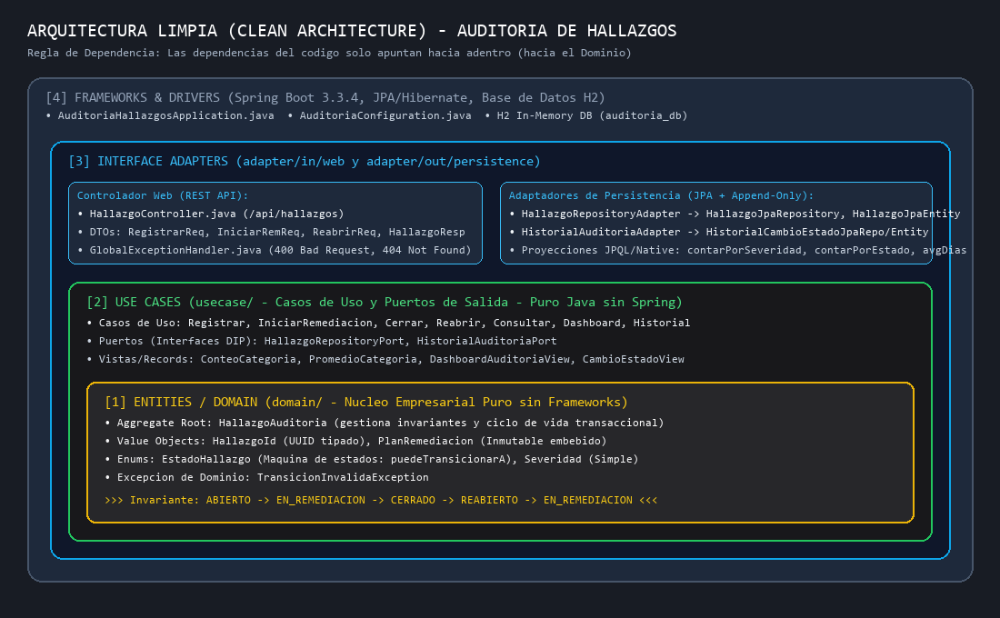
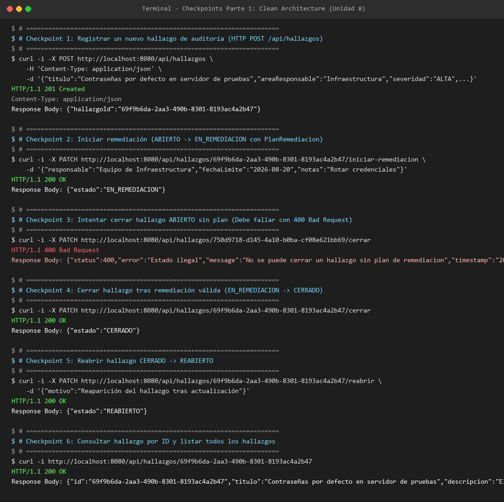
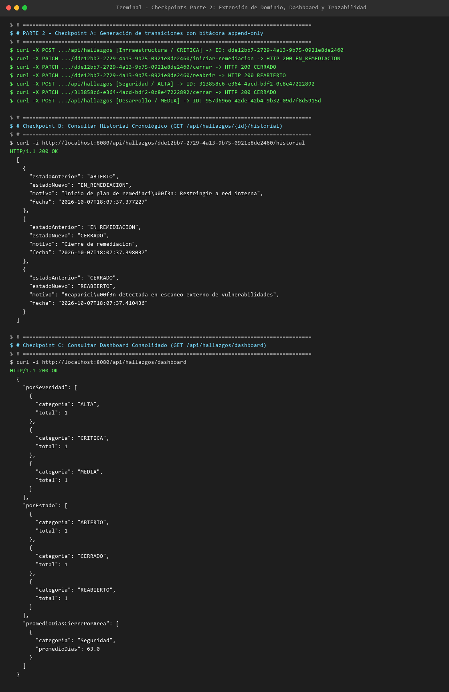

# Post-contenido – Unidad 8: Patrones Arquitectónicos II
## Clean Architecture y análisis costo-beneficio de CQRS/Event Sourcing

**Asignatura:** Patrones de Diseño de Software  
**Autor:** Jhoseth Rozo  
**Repositorio GitHub:** [https://github.com/JhosethRozo/rozo-post1-u8](https://github.com/JhosethRozo/rozo-post1-u8)  

---

## 1. Descripción del Proyecto

Repositorio oficial del post-contenido de la Unidad 8 de Patrones de Diseño de Software. Este proyecto implementa el backend de un sistema de seguimiento y gestión de hallazgos de auditoría interna universitaria/empresarial sobre un único proyecto Spring Boot (`auditoria-hallazgos`), desarrollado en dos fases complementarias:

1. **Parte 1 – Clean Architecture:** Construcción integral de los cuatro círculos concéntricos de Clean Architecture (Robert C. Martin): Entities, Use Cases, Interface Adapters y Frameworks & Drivers. El modelo de dominio encapsula una máquina de estados estricta en el Aggregate Root y Value Objects inmutables, manteniendo pureza absoluta sin dependencias de frameworks externos.
2. **Parte 2 – Extensión del Sistema y Análisis Costo-Beneficio:** Incorporación de dos nuevos requerimientos de negocio (Dashboard analítico consolidado para el comité de auditoría y Bitácora de trazabilidad legal cronológica append-only para el área de Cumplimiento), sustentados mediante un riguroso análisis costo-beneficio frente a la adopción de CQRS y Event Sourcing completos vs. una extensión liviana justificada.

---

## 2. Diagrama de Arquitectura y Estructura por Círculos

Clean Architecture establece la **Regla de Dependencia**: el código fuente solo puede depender de elementos que se encuentren en círculos concéntricos más internos. El círculo de Dominio (`domain/`) no conoce Use Cases, ni Adapters, ni Spring Boot/JPA.



### Estructura de Paquetes en el Proyecto

```
rozo-post1-u8/
├── pom.xml
├── src/
│   ├── main/
│   │   ├── java/com/example/auditoria/
│   │   │   ├── domain/                                 # [1] CÍRCULO ENTITIES (Dominio Puro)
│   │   │   │   ├── entity/
│   │   │   │   │   └── HallazgoAuditoria.java          # Aggregate Root con invariantes de ciclo de vida
│   │   │   │   └── valueobject/
│   │   │   │       ├── HallazgoId.java                 # Identity Value Object tipado (UUID)
│   │   │   │       ├── Severidad.java                  # Enum simple (CRITICA, ALTA, MEDIA, BAJA)
│   │   │   │       ├── EstadoHallazgo.java             # Enum con máquina de estados (puedeTransicionarA)
│   │   │   │       ├── PlanRemediacion.java            # Value Object inmutable embebido
│   │   │   │       └── TransicionInvalidaException.java
│   │   │   ├── usecase/                                # [2] CÍRCULO USE CASES (Aplicación)
│   │   │   │   ├── RegistrarHallazgoUseCase.java       # Interfaces de Casos de Uso
│   │   │   │   ├── IniciarRemediacionUseCase.java
│   │   │   │   ├── CerrarHallazgoUseCase.java
│   │   │   │   ├── ReabrirHallazgoUseCase.java
│   │   │   │   ├── ConsultarHallazgoUseCase.java
│   │   │   │   ├── ObtenerDashboardAuditoriaUseCase.java # (Parte 2)
│   │   │   │   ├── ConsultarHistorialUseCase.java      # (Parte 2)
│   │   │   │   ├── HallazgoNotFoundException.java
│   │   │   │   ├── port/                               # Puertos de Salida (DIP)
│   │   │   │   │   ├── HallazgoRepositoryPort.java     # Puerto principal de persistencia y dashboard
│   │   │   │   │   ├── HistorialAuditoriaPort.java     # Puerto de bitácora append-only (Parte 2)
│   │   │   │   │   ├── ConteoCategoria.java            # Records de transporte
│   │   │   │   │   ├── PromedioCategoria.java
│   │   │   │   │   ├── DashboardAuditoriaView.java
│   │   │   │   │   └── CambioEstadoView.java
│   │   │   │   └── impl/                               # Implementaciones de Casos de Uso
│   │   │   │       ├── RegistrarHallazgoService.java
│   │   │   │       ├── IniciarRemediacionService.java
│   │   │   │       ├── CerrarHallazgoService.java
│   │   │   │       ├── ReabrirHallazgoService.java
│   │   │   │       ├── ConsultarHallazgoService.java
│   │   │   │       ├── ObtenerDashboardAuditoriaService.java
│   │   │   │       └── ConsultarHistorialService.java
│   │   │   ├── adapter/                                # [3] CÍRCULO INTERFACE ADAPTERS
│   │   │   │   ├── in/web/                             # Adaptadores Primarios / Entrada
│   │   │   │   │   ├── HallazgoController.java         # Controlador REST (/api/hallazgos)
│   │   │   │   │   ├── GlobalExceptionHandler.java     # Mapeo de errores a 400 y 404
│   │   │   │   │   └── dto/                            # DTOs HTTP
│   │   │   │   │       ├── RegistrarHallazgoRequest.java
│   │   │   │   │       ├── IniciarRemediacionRequest.java
│   │   │   │   │       ├── ReabrirRequest.java
│   │   │   │   │       └── HallazgoResponse.java
│   │   │   │   └── out/persistence/                    # Adaptadores Secundarios / Salida
│   │   │   │       ├── HallazgoJpaEntity.java          # Mapeo ORM JPA para Hallazgo
│   │   │   │       ├── HallazgoJpaRepository.java      # Spring Data JPA + Proyecciones JPQL/Native
│   │   │   │       ├── HallazgoRepositoryAdapter.java  # Implementación de HallazgoRepositoryPort
│   │   │   │       ├── HistorialCambioEstadoJpaEntity.java # Tabla append-only de auditoría
│   │   │   │       ├── HistorialCambioEstadoJpaRepository.java
│   │   │   │       └── HistorialAuditoriaAdapter.java  # Implementación de HistorialAuditoriaPort
│   │   │   └── config/                                 # [4] CÍRCULO FRAMEWORKS & DRIVERS
│   │   │       └── AuditoriaConfiguration.java         # Inyección explícita de dependencias (@Bean)
│   │   │   └── AuditoriaHallazgosApplication.java      # Entry point Spring Boot
│   │   └── resources/
│   │       └── application.properties                  # H2 en memoria, JPA DDL
│   └── test/java/com/example/auditoria/
│       ├── domain/
│       │   └── HallazgoAuditoriaDomainTest.java        # Pruebas unitarias de dominio puro (sin Spring)
│       ├── HallazgosParte1IntegrationTest.java         # Pruebas de integración de endpoints (Parte 1)
│       └── AuditoriaParte2IntegrationTest.java         # Pruebas de integración Dashboard y Bitácora (Parte 2)
└── docs/
    ├── diagrama-arquitectura.png                       # Diagrama visual de capas
    ├── captura-checkpoints-parte1.png                  # Evidencia visual checkpoints Parte 1
    └── captura-checkpoints-parte2.png                  # Evidencia visual checkpoints Parte 2
```

---

## 3. Parte 1 – Clean Architecture (Hallazgos de Auditoría Interna)

### 3.1 Responsabilidades de los Cuatro Círculos Concéntricos

1. **Entities (`com.example.auditoria.domain`):**
   - Agrupa las reglas de negocio críticas y los objetos de dominio esenciales.
   - El **Aggregate Root** [`HallazgoAuditoria`](file:///C:/Users/Public/Dev/Patrones%20de%20diseño/rozo-post1-u8/src/main/java/com/example/auditoria/domain/entity/HallazgoAuditoria.java) controla rigurosamente el estado del hallazgo, garantizando que ninguna mutación ocurra sin validar sus invariantes.
   - La máquina de estados en [`EstadoHallazgo`](file:///C:/Users/Public/Dev/Patrones%20de%20diseño/rozo-post1-u8/src/main/java/com/example/auditoria/domain/valueobject/EstadoHallazgo.java) define el ciclo de vida:
     $$\text{ABIERTO} \longrightarrow \text{EN\_REMEDIACION} \longrightarrow \text{CERRADO} \longrightarrow \text{REABIERTO} \longrightarrow \text{EN\_REMEDIACION}$$
   - **Pureza Verificada:** No contiene imports de `org.springframework` ni de `jakarta.persistence`. Puede instanciarse y probarse con JUnit estándar en milisegundos sin arrancar Spring Boot.

2. **Use Cases (`com.example.auditoria.usecase`):**
   - Modela las operaciones del sistema orientadas a intención de negocio (`RegistrarHallazgoUseCase`, `IniciarRemediacionUseCase`, `CerrarHallazgoUseCase`, `ReabrirHallazgoUseCase`, `ConsultarHallazgoUseCase`).
   - Define los contratos de salida (puertos) como interfaces [`HallazgoRepositoryPort`](file:///C:/Users/Public/Dev/Patrones%20de%20diseño/rozo-post1-u8/src/main/java/com/example/auditoria/usecase/port/HallazgoRepositoryPort.java) aplicando el **Principio de Inversión de Dependencias (DIP)**.
   - No contiene dependencias de infraestructura ni anotaciones `@Service` de Spring.

3. **Interface Adapters (`com.example.auditoria.adapter`):**
   - **Entrada (`adapter/in/web`):** [`HallazgoController`](file:///C:/Users/Public/Dev/Patrones%20de%20diseño/rozo-post1-u8/src/main/java/com/example/auditoria/adapter/in/web/HallazgoController.java) convierte peticiones HTTP REST y JSON a tipos de dominio/casos de uso, y expone respuestas estandarizadas. [`GlobalExceptionHandler`](file:///C:/Users/Public/Dev/Patrones%20de%20diseño/rozo-post1-u8/src/main/java/com/example/auditoria/adapter/in/web/GlobalExceptionHandler.java) traduce excepciones de dominio a códigos de estado HTTP (400 Bad Request, 404 Not Found).
   - **Salida (`adapter/out/persistence`):** [`HallazgoRepositoryAdapter`](file:///C:/Users/Public/Dev/Patrones%20de%20diseño/rozo-post1-u8/src/main/java/com/example/auditoria/adapter/out/persistence/HallazgoRepositoryAdapter.java) implementa el puerto del caso de uso traduciendo bidireccionalmente entre el agregado de dominio y la entidad relacional [`HallazgoJpaEntity`](file:///C:/Users/Public/Dev/Patrones%20de%20diseño/rozo-post1-u8/src/main/java/com/example/auditoria/adapter/out/persistence/HallazgoJpaEntity.java).

4. **Frameworks & Drivers (`com.example.auditoria.config`):**
   - Aloja la configuración externa y el cableado explícito de componentes mediante [`AuditoriaConfiguration`](file:///C:/Users/Public/Dev/Patrones%20de%20diseño/rozo-post1-u8/src/main/java/com/example/auditoria/config/AuditoriaConfiguration.java) con métodos `@Bean`, manteniendo a los casos de uso agnósticos del contenedor IoC de Spring.

---

## 4. Parte 2 – Análisis Costo-Beneficio de CQRS / Event Sourcing

Frente a los dos nuevos requerimientos de negocio planteados por el comité de auditoría (Dashboard consolidado) y el área de Cumplimiento (Trazabilidad legal de cada cambio de estado), se realizó un análisis costo-beneficio exhaustivo aplicando los criterios de la **Sección 7 ("Criterios de Selección y Complejidad Justificada")** y **Secciones 4.4 y 5.5** de la guía de la unidad:

| Criterio (Guía, Secciones 7, 4.4 y 5.5) | Pregunta de Evaluación para este Proyecto | Análisis Razonado y Justificación Técnica |
| :--- | :--- | :--- |
| **Escala y carga** | ¿Cuántos usuarios concurrentes reales tendrá este sistema académico? ¿Existe una diferencia de escala entre lecturas y escrituras que justifique infraestructura separada? | **Análisis:** En este contexto académico y organizacional, el volumen de operaciones es de baja a media concurrencia (auditorías periódicas con decenas o cientos de registros mensuales, no millones de transacciones por segundo). La proporción lecturas/escrituras no exhibe una asimetría extrema que sature la base de datos relacional. Introducir una base de datos de lectura independiente (como Elasticsearch o MongoDB) y sincronización asíncrona mediante buses de mensajería (Kafka/RabbitMQ) introduce costos operacionales, infraestructura adicional y riesgo de latencias que no ofrecen beneficio tangible frente a la carga real. |
| **Complejidad de las consultas** | ¿Los conteos y promedios del dashboard requieren un modelo de lectura con tecnología distinta (otra base de datos, otro esquema), o son alcanzables con una consulta JPQL con GROUP BY sobre el mismo esquema? | **Análisis:** Las agregaciones requeridas (conteo por severidad, conteo por estado y promedio de días transcurridos entre detección y cierre agrupados por área responsable) son perfectamente expresables mediante proyecciones JPQL estándar (`GROUP BY`, `COUNT`, `AVG`) y funciones de fecha SQL soportadas nativamente por el motor relacional. No existen desnormalizaciones multidimensionales masivas ni joins a decenas de tablas que justifiquen desacoplar el modelo de lectura en un esquema de lectura denormalizado independiente. |
| **Consistencia** | ¿El comité necesita el dashboard actualizado en tiempo real, o es aceptable —incluso esperable— que refleje el estado al momento de la consulta, igual que cualquier reporte generado bajo demanda? | **Análisis:** El comité de auditoría evalúa el dashboard de forma periódica bajo demanda para reuniones mensuales y seguimiento ejecutivo. No se exige streaming de analítica en sub-milisegundos ni se toleraría *consistencia eventual* si un auditor acaba de cerrar un hallazgo crítico y no lo ve reflejado inmediatamente en la reunión. La consistencia fuerte (ACID) que provee el modelo relacional transaccional es la más adecuada para reportes auditables exactos. |
| **Naturaleza de la trazabilidad exigida** | ¿Cumplimiento necesita reconstruir el ESTADO completo del hallazgo reproduciendo eventos uno por uno (Event Sourcing), o le basta una bitácora cronológica adicional que coexista con el estado actual ya persistido? | **Análisis:** El requerimiento legal de Cumplimiento exige saber quién cambió el estado, cuándo, cuál fue el estado anterior y cuál el nuevo, con el motivo del cambio, garantizando inmutabilidad histórica. No existe la necesidad de "viajar en el tiempo" para reconstruir proyecciones hipotéticas retrospectivas de campos arbitrarios o reconstruir el agregado por replay de eventos. Una bitácora de auditoría transaccional append-only (`historial_cambios_estado`) satisface plenamente el requisito legal sin desmontar el agregado existente. |
| **Señales de sobre-ingeniería (Sección 7.2)** | ¿Existe un experto de negocio disponible para modelado de eventos? ¿El equipo tiene experiencia previa con Event Sourcing? ¿El costo de dos modelos separados es proporcional al problema? | **Análisis:** El proyecto es desarrollado y mantenido por un único ingeniero. Event Sourcing introduce una carga cognitiva y técnica desmedida: versionado de eventos, serialización, snapshots, manejo de *schema evolution* y consistencia eventual entre proyecciones. Adoptar Event Sourcing y CQRS completos constituiría una clara señal de sobre-ingeniería (complejidad accidental superando a la complejidad esencial del negocio). |

### Conclusión Arquitectónica

> **Decisión Concluyente:** **No se justifica la adopción de CQRS ni Event Sourcing completos en este sistema.** La solución arquitectónica óptima y justificada consiste en una **extensión liviana y cohesionada**:
> 1. Extender [`HallazgoRepositoryPort`](file:///C:/Users/Public/Dev/Patrones%20de%20diseño/rozo-post1-u8/src/main/java/com/example/auditoria/usecase/port/HallazgoRepositoryPort.java) con métodos de proyecciones JPQL/SQL para el dashboard dentro del mismo esquema relacional.
> 2. Implementar un puerto secundario [`HistorialAuditoriaPort`](file:///C:/Users/Public/Dev/Patrones%20de%20diseño/rozo-post1-u8/src/main/java/com/example/auditoria/usecase/port/HistorialAuditoriaPort.java) respaldado por una tabla relacional append-only ([`HistorialCambioEstadoJpaEntity`](file:///C:/Users/Public/Dev/Patrones%20de%20diseño/rozo-post1-u8/src/main/java/com/example/auditoria/adapter/out/persistence/HistorialCambioEstadoJpaEntity.java)) que se escribe en la **misma transacción** que cada mutación de estado, garantizando atomicidad y trazabilidad inmutable sin alterar la fuente de verdad del agregado.

---

## 5. Decisiones de Diseño Justificadas

### Punto de Decisión 1: Severidad como Enum Simple vs. EstadoHallazgo como Enum con Máquina de Estados
- **Elección:** [`Severidad`](file:///C:/Users/Public/Dev/Patrones%20de%20diseño/rozo-post1-u8/src/main/java/com/example/auditoria/domain/valueobject/Severidad.java) se modela como un enum simple de 4 constantes (`CRITICA, ALTA, MEDIA, BAJA`), mientras que [`EstadoHallazgo`](file:///C:/Users/Public/Dev/Patrones%20de%20diseño/rozo-post1-u8/src/main/java/com/example/auditoria/domain/valueobject/EstadoHallazgo.java) se implementa como un enum con comportamiento que expone el método `puedeTransicionarA(EstadoHallazgo destino)`.
- **Justificación:** `Severidad` es una etiqueta de clasificación estática que no impone reglas de transición (no existe una restricción temporal que impida a un hallazgo ser creado como `CRITICA` o `BAJA`). En contraste, `EstadoHallazgo` gobierna el ciclo de vida del proceso de auditoría y contiene reglas de negocio no triviales (no se puede cerrar sin remediación previa, ni reabrir si no está cerrado). Encapsular la máquina de estados dentro del propio enum promueve alta cohesión, evita lógica condicional dispersa en los servicios y protege al agregado ante estados corruptos.
- **Alternativa Descartada:** Tratar ambos como enums anémicos transferiría la validación a if/else en la capa de aplicación, diluyendo las reglas del dominio y permitiendo transiciones ilegales accidentales.

### Punto de Decisión 2: PlanRemediacion como Value Object Embebido vs. Agregado Separado
- **Elección:** [`PlanRemediacion`](file:///C:/Users/Public/Dev/Patrones%20de%20diseño/rozo-post1-u8/src/main/java/com/example/auditoria/domain/valueobject/PlanRemediacion.java) se implementa como un Value Object inmutable (`record`) embebido dentro del Aggregate Root [`HallazgoAuditoria`](file:///C:/Users/Public/Dev/Patrones%20de%20diseño/rozo-post1-u8/src/main/java/com/example/auditoria/domain/entity/HallazgoAuditoria.java), en lugar de una entidad/agregado con repositorio propio.
- **Justificación (Límite de Consistencia Transaccional - DDD / Sección 3.3 de la guía):** En Domain-Driven Design, el límite de un agregado delimita la consistencia transaccional inmediata. Un hallazgo no puede transicionar a `EN_REMEDIACION` sin tener un plan válido asignado, ni puede transicionar a `CERRADO` si dicho plan no existió. Si el plan fuera un agregado independiente con su propio repositorio, existiría una ventana de inconsistencia transaccional donde un plan podría eliminarse o quedar huérfano mientras el hallazgo permanece en remediación. Embeber el plan garantiza que las invariantes de negocio se cumplan de forma atómica en una única transacción sin complejidad de llaves foráneas o transacciones distribuidas.
- **Alternativa Descartada:** Un agregado independiente requeriría coordinación entre múltiples repositorios y manejo de concurrencia optimista cruzada sin aportar beneficios, ya que un plan de remediación no tiene sentido de existencia fuera del hallazgo al que pertenece.

### Punto de Decisión 3: CQRS/Event Sourcing Completos vs. Extensión Liviana del Repositorio Existente
- **Elección:** Extensión liviana sobre el mismo puerto [`HallazgoRepositoryPort`](file:///C:/Users/Public/Dev/Patrones%20de%20diseño/rozo-post1-u8/src/main/java/com/example/auditoria/usecase/port/HallazgoRepositoryPort.java) y adaptador [`HallazgoJpaRepository`](file:///C:/Users/Public/Dev/Patrones%20de%20diseño/rozo-post1-u8/src/main/java/com/example/auditoria/adapter/out/persistence/HallazgoJpaRepository.java) mediante interface projections (`contarPorSeveridad`, `contarPorEstado`, `promedioDiasCierrePorArea`), descartando stacks separados de comando y consulta.
- **Justificación (Criterios de Selección y Complejidad Justificada - Sección 7 de la guía):** La separación de stacks (Command Stack vs. Query Stack) en bases de datos separadas solo se justifica ante problemas de contención de lectura/escritura extremos o requerimientos de búsqueda denormalizada de alta complejidad. Las agregaciones del dashboard son consultas SQL inmediatas agrupadas por columnas indexadas. Mantener un único repositorio para lecturas y escrituras elimina la sincronización asíncrona, previene fallos de consistencia eventual y reduce sustancialmente el costo de mantenimiento del código.
- **Qué se sacrificaría al decidir lo contrario:** Se sacrificaría simplicidad operacional, consistencia inmediata y facilidad de despliegue, introduciendo el riesgo de discrepancias entre los modelos de lectura y escritura ante caídas de red o fallos en los consumidores de eventos.

### Punto de Decisión 4: Bitácora Simple (HistorialCambioEstado) vs. Event Store Completo
- **Elección:** Bitácora transaccional append-only ([`HistorialCambioEstadoJpaEntity`](file:///C:/Users/Public/Dev/Patrones%20de%20diseño/rozo-post1-u8/src/main/java/com/example/auditoria/adapter/out/persistence/HistorialCambioEstadoJpaEntity.java)) que coexiste con [`HallazgoJpaEntity`](file:///C:/Users/Public/Dev/Patrones%20de%20diseño/rozo-post1-u8/src/main/java/com/example/auditoria/adapter/out/persistence/HallazgoJpaEntity.java). La entidad del hallazgo permanece como la única fuente de la verdad para el estado actual.
- **Justificación (Señales de Sobre-Ingeniería - Sección 7.2 de la guía):** En Event Sourcing, los eventos son la fuente de la verdad y el estado actual se reconstruye ejecutando un *replay* secuencial de todos los eventos del agregado. Esto requiere implementar *event stores*, serializadores con tolerancia a cambios de esquema (upcasters) y *snapshots* para agregados con muchas mutaciones. Cumplimiento legal únicamente exige una auditoría forense inmutable de cuándo y quién originó cada transición. Al usar una tabla relacional append-only que solo admite operaciones de inserción (sin métodos de actualización o eliminación), se cumple el 100% del requerimiento de trazabilidad sin reemplazar el modelo de estado consolidado que ya funciona y está probado.
- **Qué se sacrificaría al decidir lo contrario:** Reescribir `HallazgoAuditoria` para depender de eventos agregaría una capa masiva de complejidad técnica, degradaría el rendimiento de lectura del estado actual al exigir reconstrucción por bucle de eventos, y requeriría mecanismos complejos de migración de esquema de eventos futuros.

---

## 6. Evidencias Visuales de Verificación (Checkpoints)

### Checkpoints de la Parte 1
Verificación de los endpoints del ciclo de vida del hallazgo:
- Registro exitoso con HTTP 201 Created y retorno de `hallazgoId` (UUID).
- Inicio de remediación exitoso con HTTP 200 OK y estado `EN_REMEDIACION`.
- Rechazo estricto al intentar cerrar un hallazgo sin plan de remediación previo con HTTP 400 Bad Request.
- Cierre exitoso tras remediación con HTTP 200 OK y estado `CERRADO`.
- Reapertura exitosa con motivo registrado retornando HTTP 200 OK y estado `REABIERTO`.
- Consulta detallada por ID y listado general.



### Checkpoints de la Parte 2
Verificación de la extensión del dashboard consolidado y la bitácora append-only:
- Inserción automática de un registro append-only en `historial_cambios_estado` en cada transición exitosa.
- Endpoint `GET /api/hallazgos/{id}/historial` retornando la secuencia cronológica exacta de cambios.
- Endpoint `GET /api/hallazgos/dashboard` consolidando los conteos por severidad, conteos por estado y el promedio de días transcurridos entre detección y cierre agrupados por área responsable.



---

## 7. Instrucciones de Compilación y Ejecución

### Prerrequisitos
- Java JDK 17 o superior (verificado con JDK 17 y JDK 21+).
- Apache Maven 3.8 o superior.
- Conexión a red para descargar dependencias iniciales de Maven.

### Compilar y Ejecutar Pruebas Automatizadas
Para ejecutar la suite completa de 8 pruebas unitarias y de integración que validan la máquina de estados, el aislamiento del dominio, los endpoints REST, el dashboard y la bitácora:

```bash
mvn clean test
```

### Ejecutar la Aplicación Spring Boot
Para iniciar la API REST en el puerto local 8080:

```bash
mvn spring-boot:run
```
O empaquetar y ejecutar directamente el archivo JAR:

```bash
mvn clean package
java -jar target/auditoria-hallazgos-0.0.1-SNAPSHOT.jar
```

- **Consola H2:** [http://localhost:8080/h2-console](http://localhost:8080/h2-console)  
  - JDBC URL: `jdbc:h2:mem:auditoria_db`
  - Usuario: `sa`
  - Contraseña: *(vacía)*
- **API REST Base:** [http://localhost:8080/api/hallazgos](http://localhost:8080/api/hallazgos)

---

## 8. Herramientas Utilizadas

- **Lenguaje:** Java 17 (LTS)
- **Framework:** Spring Boot 3.3.4
- **Persistencia:** Spring Data JPA, Hibernate 6.5.3, H2 Database (In-Memory)
- **Validación:** Jakarta Bean Validation (`spring-boot-starter-validation`)
- **Testing:** JUnit 5, MockMvc, Spring Boot Test, ByteBuddy Agent
- **Build Tool:** Apache Maven 3.9+
- **Control de Versiones:** Git, GitHub
- **Generación de Evidencias:** Python 3 + Pillow (PIL)

---

## 9. Conclusiones y Lecciones Aprendidas

1. **La pureza del Dominio en Clean Architecture es una salvaguarda tangible:** Mantener `domain/` con cero dependencias de Spring Boot o JPA permite probar toda la lógica de negocio y la máquina de estados en pruebas unitarias puras que corren en menos de 20 milisegundos, desacoplando completamente el valor empresarial de las decisiones tecnológicas de infraestructura.
2. **La arquitectura debe ser impulsada por la necesidad real y no por la moda tecnológica:** CQRS y Event Sourcing son patrones poderosos pero conllevan una carga de complejidad técnica y operacional sumamente elevada. En sistemas donde el volumen de transacciones no satura la base de datos y donde la consistencia fuerte es preferida sobre la eventual, extender el repositorio relacional existente con proyecciones y bitácoras append-only entrega exactamente el valor de negocio solicitado con un orden de magnitud menor de costo y riesgo.
3. **Criterios para reconsiderar la decisión si el sistema crece en el futuro:** Si la organización alcanzara millones de hallazgos activos con auditorías en tiempo real generadas por miles de dispositivos IoT o analistas concurrentes simultáneos, o si el negocio exigiera reconstruir el estado corporativo a cualquier segundo del pasado para simular escenarios regulatorios retroactivos ("what-if analysis"), en ese punto la relación costo-beneficio cambiaría, justificando plenamente migrar hacia un Event Store distribuido con CQRS completo.
